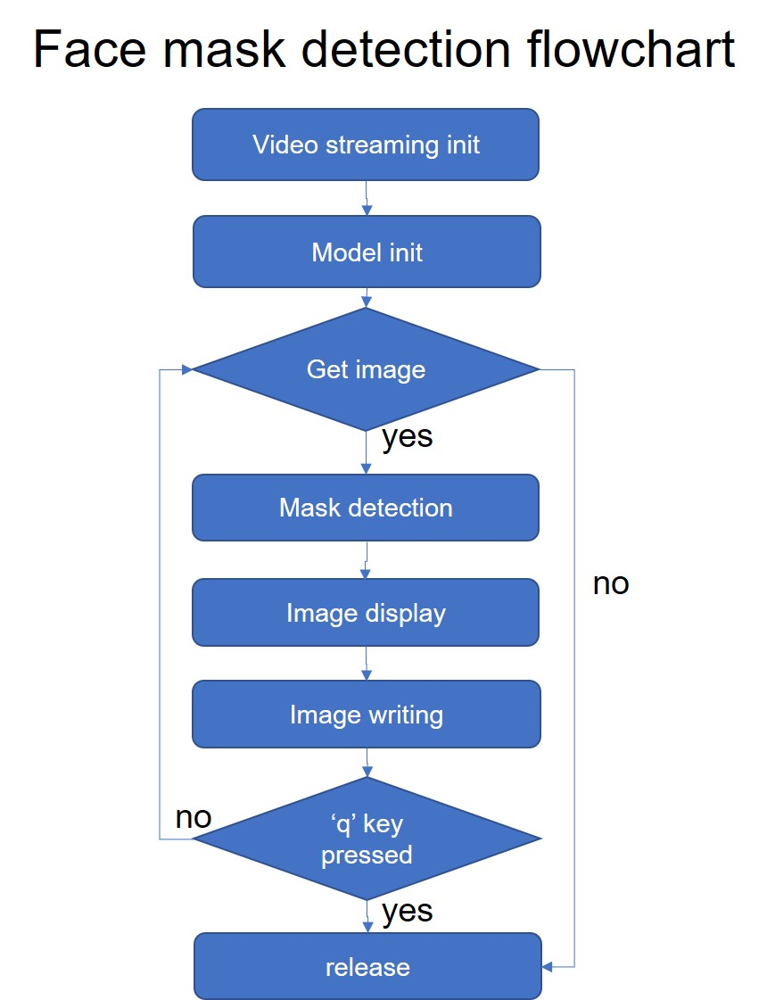

# face_mask_detection

●使用Python, openCV, AI object detection(SSD)進行口罩偵測的教學 

●主要參考AIZOOTech的[FaceMaskDetection](https://github.com/AIZOOTech/FaceMaskDetection)並使用其所提供的Tensorflow pb file進行改寫

●Tensorflow version:1.13

程式碼的詳細解說請至[影片連結](https://www.youtube.com/watch?v=JM2lUTSlbwg)

●流程圖如下

